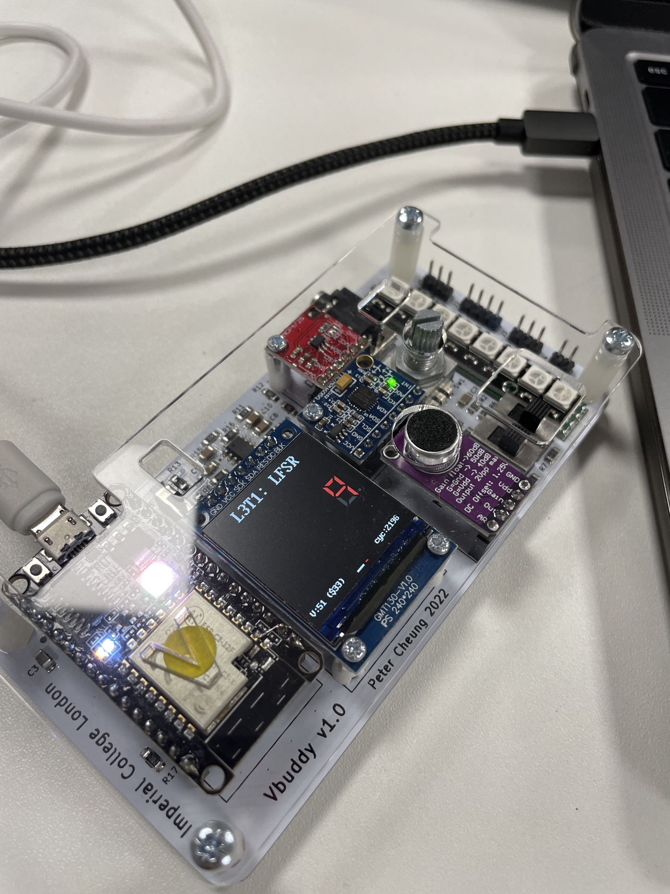

## Lab 3 - Finite State Machines (FSM)

---

---
## Task 1 - 4-bit LFSR and Pseudo Random Binary Sequence
---

I created the LSFR as specified in the instuctions.

  

  

TEST YOURSELF CHALLENGE 

___

Based on the **_primitive polynomial_** table in Lecture 4 slide 16, modify **_lfsr.sv_** into a 7-bit (instead of 4-bit) PRBS generator. Test your design.  The 7th order primitive polynomial is:

  

