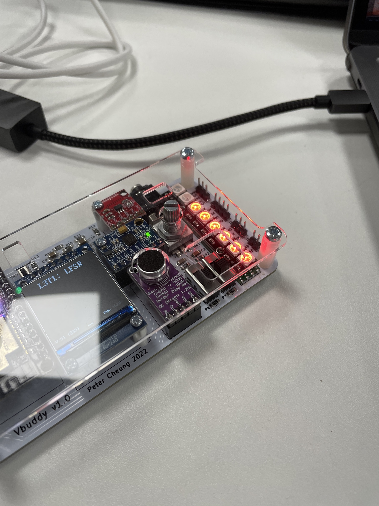

<center>


## Lab 3 - Finite State Machines (FSM)

---

</center>


---
## Task 1 - 4-bit LFSR and Pseudo Random Binary Sequence
---

I created the LSFR as specified in the instuctions.

<p align="center">  </p>

<p align="center">  </p>

<p align="center">TEST YOURSELF CHALLENGE </p>

___

Based on the **_primitive polynomial_** table in Lecture 4 slide 16, modify **_lfsr.sv_** into a 7-bit (instead of 4-bit) PRBS generator. Test your design.  The 7th order primitive polynomial is:

<p align="center">  </p>

---
## Task 2 - Formula 1 Light Sequence
---

Formula 1 (F1) racing has starting light consists of a series of red lights that turn ON one by one, until all lights are ON. Then all of them turn OFF simultaneously after a random delay.

<p align="center">  </p>


<p align="center">  </p>

I implemented this in system verilog and also created the testbench.

<p align="center">  </p>

---
## Task 3 - Exploring the **_clktick.sv_** and the **_delay.sv_** modules
---

In Lecture 4 slides 9 & 10, you were introduced to the **_clktick.sv_** module. The interface signals for this module is:

```Verilog
module clktick #(
	parameter WIDTH = 16
)(
  // interface signals
  input  logic             clk,      // clock 
  input  logic             rst,      // reset
  input  logic             en,       // enable signal
  input  logic [WIDTH-1:0] N,     	 // clock divided by N+1
  output logic  		   tick      // tick output
);
```

___

<p align="center">TEST YOURSELF CHALLENGE </p>

___

Implement the following design by combining **_clkctick.sv_** with **_f1_fsm.sv_** so that the F1 light sequence is cycle through automatically with 1 second delay per state transition.

<p align="center">  </p>

---